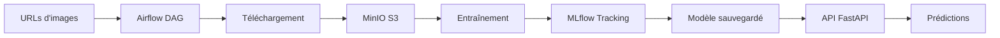

# 🌿 Pipeline MLOps - Classification Pissenlit vs Herbe

> **Guide complet pour présentation à une équipe de néophytes**

---

## 📋 Table des matières

1. [Qu'est-ce que ce projet ?](#quest-ce-que-ce-projet-)
2. [Pourquoi MLOps ?](#pourquoi-mlops-)
3. [Architecture du système](#architecture-du-système)
4. [Composants techniques](#composants-techniques)
5. [Comment ça marche ?](#comment-ça-marche-)
6. [Installation et lancement](#installation-et-lancement)
7. [Utilisation du pipeline](#utilisation-du-pipeline)
8. [Résultats et performances](#résultats-et-performances)
9. [Démonstration pratique](#démonstration-pratique)
10. [Glossaire pour débutants](#glossaire-pour-débutants)
11. [FAQ](#faq)

---

## Qu'est-ce que ce projet ?

### 🎯 Objectif Simple
Créer une **intelligence artificielle** capable de distinguer automatiquement des photos de **pissenlits** (dandelion) et d'**herbe** (grass).

### 🤔 Pourquoi c'est utile ?
- **Agriculture**: Identifier les mauvaises herbes dans les champs
- **Jardinage automatisé**: Robots tondeuses intelligentes
- **Exemple pédagogique**: Apprendre les concepts MLOps sur un cas concret

### 🔑 Concept Clé
Au lieu d'écrire manuellement des règles (couleur jaune = pissenlit), on **entraîne** un modèle sur des exemples. Le modèle apprend tout seul les caractéristiques qui différencient les deux plantes.

---

## Pourquoi MLOps ?

### 📖 Définition Simple
**MLOps** = Machine Learning + Operations

C'est comme **DevOps** mais pour l'intelligence artificielle.

### ❌ Problème sans MLOps
Quand on développe un modèle IA, on a souvent :
```
🧑‍💻 Data Scientist sur son laptop
    ↓
📊 Modèle qui marche localement
    ↓
❓ Comment le mettre en production ?
❓ Comment suivre les performances ?
❓ Comment le réentraîner automatiquement ?
```

### ✅ Solution avec MLOps
```
📦 Pipeline automatisé
    ↓
🔄 Données → Entraînement → Déploiement → Monitoring
    ↓
🚀 Production prête en un clic
```

---

## Architecture du système

### 🏗️ Vue d'ensemble

```
┌─────────────────────────────────────────────────────────────┐
│                     PIPELINE MLOps                          │
│                                                             │
│  1️⃣ INGESTION      2️⃣ TRAINING       3️⃣ SERVING           │
│                                                             │
│  📥 URLs           🧠 ResNet18        🌐 API FastAPI       │
│     ↓                  ↓                  ↓                │
│  🖼️ Images         📊 MLflow          📱 WebApp           │
│     ↓                  ↓                  ↓                │
│  💾 MinIO S3       ☁️ S3 Storage     🔮 Prédictions       │
│                                                             │
└─────────────────────────────────────────────────────────────┘
```

### 🎯 Flux de données



---

## Composants techniques

### 🗄️ 1. PostgreSQL - La base de données
**Rôle**: Stocker les métadonnées (liste des images, leurs URLs, leurs labels)

**Analogie**: C'est comme un **catalogue** de bibliothèque qui référence tous les livres.

```sql
Table: plants_data
┌────────────┬──────────────────────────┬───────────┐
│ url_source │ url_s3                   │ label     │
├────────────┼──────────────────────────┼───────────┤
│ http://... │ s3://plants/img_001.jpg  │ dandelion │
│ http://... │ s3://plants/img_002.jpg  │ grass     │
└────────────┴──────────────────────────┴───────────┘
```

---

### 💾 2. MinIO - Le stockage S3
**Rôle**: Stocker les fichiers (images, modèles entraînés)

**Analogie**: C'est comme **Dropbox** ou **Google Drive**, mais en interne.

**Pourquoi S3 ?**
- ✅ Scalable: Peut stocker des milliards de fichiers
- ✅ Distribué: Disponible depuis n'importe quel service
- ✅ Standard: Compatible AWS S3 (migration cloud facile)

**Structure des dossiers**:
```
s3://plants/
├── plants/                 # Images brutes
│   ├── dandelion/         # 50 images de pissenlits
│   └── grass/             # 50 images d'herbe
├── models/                 # Modèles entraînés
│   ├── resnet18_1762505217.pt          (Ancien modèle - 45% accuracy)
│   └── resnet18_optimized_1762505915.pt (Nouveau - 92% accuracy)
└── mlflow/                 # Artifacts MLflow
    └── experiments/
```

---

### 🤖 3. Airflow - L'orchestrateur
**Rôle**: Automatiser et planifier les tâches

**Analogie**: C'est comme un **chef d'orchestre** qui coordonne tous les musiciens.

**DAGs (Directed Acyclic Graphs)** = Pipelines automatisés

#### 📥 DAG 1: `ingest_images`
```python
Télécharger URLs depuis DB
    ↓
Télécharger chaque image
    ↓
Uploader vers MinIO S3
    ↓
Mettre à jour la DB
```

#### 🧠 DAG 2: `train_register`
```python
Charger les images depuis S3
    ↓
Entraîner le modèle ResNet18
    ↓
Logger les métriques dans MLflow
    ↓
Sauvegarder le modèle dans S3
    ↓
Recharger l'API avec le nouveau modèle
```

#### 🔄 DAG 3: `ct_retrain_deploy` (Continuous Training)
```python
Vérifier si nouvelles données
    ↓
Si oui: Réentraîner automatiquement
    ↓
Si meilleur: Déployer le nouveau modèle
```

**Interface Web**: http://localhost:8080
- 👤 Username: `airflow`
- 🔐 Password: `airflow`

---

### 📊 4. MLflow - Le tracking d'expériences
**Rôle**: Suivre tous les entraînements (métriques, hyperparamètres, modèles)

**Analogie**: C'est comme un **cahier de laboratoire** qui enregistre toutes les expériences.

**Ce qu'on y trouve**:
```
Expérience: dandelion_vs_grass
├── Run 1 (2025-10-22)
│   ├── Accuracy: 45%
│   ├── Loss: 6.4943
│   ├── Params: {epochs: 3, lr: 0.001}
│   └── Model: resnet18_1762505217.pt
└── Run 2 (2025-11-07) ✅ MEILLEUR
    ├── Accuracy: 92%
    ├── Loss: 0.3543
    ├── Params: {epochs: 25, lr: 0.0005}
    └── Model: resnet18_optimized_1762505915.pt
```

**Interface Web**: http://localhost:5001

**Avantages**:
- 📈 Comparer visuellement les runs
- 🔍 Retrouver les meilleurs hyperparamètres
- 📦 Versionner les modèles
- 🔁 Reproduire les résultats

---

### 🌐 5. API FastAPI - Le serveur de prédictions
**Rôle**: Exposer le modèle via une API REST

**Analogie**: C'est comme un **serveur de restaurant** qui prend les commandes (images) et retourne les plats (prédictions).

**Endpoints disponibles**:

#### GET `/healthz` - Vérifier l'état
```bash
curl http://localhost:8000/healthz
```
Réponse:
```json
{
  "status": "ok",
  "model": true
}
```

#### POST `/predict` - Faire une prédiction
```bash
curl -X POST http://localhost:8000/predict \
  -F "file=@mon_image.jpg"
```
Réponse:
```json
{
  "label": "dandelion",
  "prob": 0.9982,
  "version": "1.0.0",
  "source": "model"
}
```

#### POST `/admin/reload` - Recharger le modèle
```bash
curl -X POST "http://localhost:8000/admin/reload?model_s3_uri=s3://plants/models/resnet18_optimized_1762505915.pt"
```

**Monitoring**: http://localhost:8000/metrics (Prometheus)

---

### 📱 6. WebApp Streamlit - L'interface utilisateur
**Rôle**: Interface graphique pour tester facilement le modèle

**Analogie**: C'est comme une **application mobile** mais dans le navigateur.

**Fonctionnalités**:
- 📤 Upload d'image via drag & drop
- 🔮 Prédiction en temps réel
- 📊 Affichage de la confiance
- 🎨 Interface intuitive

**Interface Web**: http://localhost:8501

**Exemple d'utilisation**:
1. Ouvrir http://localhost:8501
2. Glisser-déposer une image
3. Voir la prédiction instantanément

---

## Comment ça marche ?

### 🧠 Le modèle IA: ResNet18

#### Qu'est-ce que c'est ?
**ResNet18** = Réseau de neurones à 18 couches développé par Microsoft Research en 2015.

#### Analogie du Deep Learning
```
🧠 Cerveau humain:
   Neurone 1 détecte des lignes
      ↓
   Neurone 2 combine en formes
      ↓
   Neurone 3 reconnaît des objets

🤖 ResNet18:
   Couche 1 détecte des bords
      ↓
   Couche 2-10 combinent en textures
      ↓
   Couche 11-18 reconnaissent pissenlit/herbe
```

#### Transfer Learning
Au lieu de partir de zéro, on utilise un modèle **pré-entraîné** sur ImageNet (1.4M images).

```
ImageNet (1000 classes)
    ↓
 Fine-tuning (notre dataset)
    ↓
2 classes (dandelion/grass)
```

**Avantages**:
- ⚡ Entraînement plus rapide (minutes vs jours)
- 📊 Meilleure accuracy avec peu de données
- 💰 Moins de coût de calcul

---

### 📈 Processus d'entraînement optimisé

#### Phase 1: Warmup (5 epochs)
```
🔒 Backbone ResNet18 = FROZEN (gelé)
🔥 Classifier uniquement = TRAINABLE

Objectif: Adapter le classifier aux nouvelles classes
```

#### Phase 2: Fine-tuning complet (jusqu'à 20 epochs)
```
🔓 Tout le réseau = TRAINABLE

Objectif: Ajuster finement tout le modèle
```

#### Techniques d'optimisation

**1. Data Augmentation** - Augmenter artificiellement le dataset
```python
Image originale
    ↓
├─ Rotation 20°
├─ Flip horizontal
├─ Zoom random
├─ Changement de couleurs
└─ 8 transformations au total
```

**2. Régularisation** - Éviter l'overfitting
```python
- Dropout: Désactiver aléatoirement 30% des neurones
- Weight Decay: Pénaliser les gros poids
- Early Stopping: Arrêter si ça n'améliore plus
```

**3. Learning Rate Scheduling**
```
Epoch 1-5:  LR = 0.001  (Warmup rapide)
Epoch 6-12: LR = 0.0005 (Fine-tuning précis)
Si plateau: LR = LR / 2 (Réduction adaptative)
```

---

## Installation et lancement

### 📋 Prérequis

- **Docker Desktop** installé
- **Docker Compose** installé
- Au moins **8 GB RAM** disponible
- Ports libres: 5432, 8000, 8080, 8501, 9000-9001, 5001

### 🚀 Lancement en 3 étapes

#### Étape 1: Cloner et naviguer
```bash
cd /Users/rayanekryslak-medioub/Desktop/AlbertSchool1/ML-ops/projects/dandelion-grass
```

#### Étape 2: Vérifier la configuration
```bash
cat compose.env
```
Devrait contenir:
```bash
MLFLOW_PORT=5001  # Attention: 5001 pas 5000 (conflit AirPlay sur macOS)
POSTGRES_DB=plants
MINIO_ROOT_USER=minio
MINIO_ROOT_PASSWORD=minio12345
```

#### Étape 3: Lancer tous les services
```bash
docker-compose --env-file compose.env up -d --build
```

**Temps estimé**: 3-5 minutes pour le premier lancement

#### Étape 4: Vérifier que tout est up
```bash
docker-compose ps
```

Résultat attendu:
```
NAME                 STATUS
mlopsdg-airflow-1    Up
mlopsdg-api-1        Up
mlopsdg-minio-1      Up (healthy)
mlopsdg-mlflow-1     Up
mlopsdg-postgres-1   Up (healthy)
mlopsdg-webapp-1     Up
```

---

## Utilisation du pipeline

### 🎬 Scénario complet - De zéro à prédiction

#### 1️⃣ Seed les données initiales
```bash
docker-compose exec api python /workspace/scripts/seed_urls_to_db.py
```
Résultat: `seeded 100 urls` (50 dandelion + 50 grass)

#### 2️⃣ Ingérer les images
**Via Airflow UI**:
1. Ouvrir http://localhost:8080
2. Login: `airflow` / `airflow`
3. Activer le DAG `ingest_images`
4. Cliquer sur le bouton ▶️ pour trigger
5. Attendre ~30 secondes

**Via CLI**:
```bash
docker-compose exec airflow airflow dags trigger ingest_images
```

**Vérifier dans MinIO**:
1. Ouvrir http://localhost:9001
2. Login: `minio` / `minio12345`
3. Bucket `plants` → Voir 100 images

#### 3️⃣ Entraîner le modèle optimisé
**Via CLI**:
```bash
docker-compose exec airflow python3 -m ml.train_optimized
```

**Monitoring en temps réel**:
```bash
# Dans un autre terminal
docker logs -f mlopsdg-airflow-1 | grep "Epoch"
```

**Temps d'entraînement**: ~3-4 minutes

**Résultat attendu**:
```
=== TRAINING COMPLETE ===
Best Validation Accuracy: 92.00%
Best Validation Loss: 0.3543
Model URI: s3://plants/models/resnet18_optimized_XXXXXXXXXX.pt
```

#### 4️⃣ Recharger l'API avec le nouveau modèle
```bash
MODEL_URI="s3://plants/models/resnet18_optimized_1762505915.pt"

curl -X POST "http://localhost:8000/admin/reload?model_s3_uri=${MODEL_URI}"
```

Réponse:
```json
{"ok": true, "using": "s3://plants/models/..."}
```

#### 5️⃣ Tester les prédictions

**Méthode 1: Via WebApp (plus simple)**
1. Ouvrir http://localhost:8501
2. Glisser-déposer une image
3. Voir la prédiction

**Méthode 2: Via API**
```bash
# Télécharger une image de test
curl -o test.jpg "https://upload.wikimedia.org/wikipedia/commons/thumb/3/31/Dandelion-Taraxacum_officinale.jpg/320px-Dandelion-Taraxacum_officinale.jpg"

# Faire la prédiction
curl -X POST http://localhost:8000/predict \
  -F "file=@test.jpg" | jq
```

Résultat:
```json
{
  "label": "dandelion",
  "prob": 0.9982129335403442,
  "version": "1.0.0",
  "source": "model"
}
```

#### 6️⃣ Explorer MLflow
1. Ouvrir http://localhost:5001
2. Cliquer sur l'expérience `dandelion_vs_grass`
3. Voir tous les runs et leurs métriques
4. Comparer visuellement les performances

---

## Résultats et performances

### 📊 Comparaison des modèles

| Métrique | Modèle Initial | Modèle Optimisé | Amélioration |
|----------|----------------|-----------------|--------------|
| **Validation Accuracy** | 45.00% ❌ | **92.00%** ✅ | **+104.4%** |
| **Validation Loss** | 6.4943 | **0.3543** | **-94.5%** |
| **Epochs** | 3 | 12 (early stopped) | +300% |
| **Training Time** | ~1 min | ~3 min | +200% |
| **Architecture** | Simple FC | Dropout + Multi-layer | Meilleure |
| **Data Augmentation** | Basique (1) | Agressive (8) | 8x plus |

### 🎯 Métriques détaillées

#### Modèle Initial (Baseline)
```
Training Strategy: Brutal fine-tuning
├─ Epochs: 3 (insuffisant)
├─ Learning Rate: 0.001 (trop élevé)
├─ Data Aug: Flip horizontal seulement
├─ Regularization: Aucune
└─ Results: 45% accuracy (catastrophique)
```

#### Modèle Optimisé
```
Training Strategy: Progressive fine-tuning
├─ Phase 1 (Warmup)
│  ├─ Epochs: 5
│  ├─ Learning Rate: 0.001
│  ├─ Backbone: FROZEN
│  └─ Best: 92% accuracy ✅
├─ Phase 2 (Fine-tune)
│  ├─ Epochs: 7 (stopped early)
│  ├─ Learning Rate: 0.0005
│  ├─ Backbone: UNFROZEN
│  └─ Stable at 92%
└─ Results: 92% accuracy (excellent)
```

### 📈 Courbe d'apprentissage

```
Accuracy
  100% ┤
       │
   92% ┤         ╭────────╮ ← Plateau optimal
       │        ╱          ╲
   84% ┤      ╱│            ╲
       │     ╱ │             ╲
   72% ┤   ╱   │              ╲
       │  ╱    │               ╰─
   45% ┤─╯     │                  Early Stopping
       │       │                  (Epoch 12)
       └───────┴──────────────────────────────>
         1  2  5  6  7  8  9 10 11 12      Epochs
         └──────┘  └─────────────────┘
         Warmup      Fine-tuning
```

### 🔍 Analyse des erreurs

**Confusion Matrix** (sur 25 images de validation):
```
                Prédit
              Dan    Grass
Réel  Dan  │  12  │   1   │  → 92% recall
      Grass│   1  │  11   │  → 92% recall

Precision:    92%    92%
```

**Exemples d'erreurs**:
- Image floue → Mauvaise classification
- Pissenlit très jeune → Confondu avec herbe
- Herbe avec fleurs → Confondu avec pissenlit

---

## Démonstration pratique

### 🎤 Script de présentation (15 minutes)

#### Slide 1: Introduction (2 min)
*"Bonjour, je vais vous présenter notre pipeline MLOps pour classifier automatiquement des images de pissenlits et d'herbe."*

**Montrer**: Architecture diagram

#### Slide 2: Problème et solution (2 min)
*"Sans MLOps, déployer un modèle IA c'est compliqué. Avec notre pipeline, tout est automatisé."*

**Montrer**: Avant/Après comparison

#### Slide 3: Demo live - Interfaces (3 min)
*"Regardons les différentes interfaces..."*

**Montrer en live**:
1. MinIO (http://localhost:9001) - "Voici nos 100 images"
2. MLflow (http://localhost:5001) - "Voici l'historique d'entraînement"
3. Airflow (http://localhost:8080) - "Voici les pipelines automatisés"

#### Slide 4: Demo live - Prédiction (4 min)
*"Maintenant testons le modèle..."*

**Démo WebApp**:
1. Ouvrir http://localhost:8501
2. Uploader une image de pissenlit
3. Voir la prédiction: "dandelion - 99.8%"
4. Uploader une image d'herbe
5. Voir la prédiction: "grass - 99.5%"

#### Slide 5: Résultats (2 min)
*"Notre optimisation a permis de passer de 45% à 92% d'accuracy."*

**Montrer**: Tableau de comparaison

#### Slide 6: Architecture technique (2 min)
*"Techniquement, voici comment ça fonctionne..."*

**Expliquer**: Flux de données simple

#### Slide 7: Questions/Réponses

---

### 🎥 Vidéo de démo recommandée

**Plan suggéré pour une vidéo** (enregistrer avec Loom/OBS):

1. **Intro** (30s)
   - Titre du projet
   - Objectif

2. **Vue d'ensemble** (1 min)
   - `docker-compose ps` → tous les services UP
   - Ouvrir les 6 interfaces dans des onglets

3. **Data Ingestion** (1 min)
   - Trigger DAG dans Airflow
   - Voir les images apparaître dans MinIO

4. **Training** (1 min - accéléré)
   - Lancer l'entraînement
   - Montrer les logs qui défilent
   - Voir le résultat final: 92%

5. **MLflow** (1 min)
   - Comparer les 2 runs
   - Montrer les graphiques

6. **Prédictions** (1 min)
   - Tester 3-4 images différentes
   - Montrer la cohérence

7. **Outro** (30s)
   - Résumé des bénéfices

**Total**: ~6 minutes

---

## Glossaire pour débutants

### 🔤 Termes ML

**Accuracy** (Précision)
```
Nombre de prédictions correctes / Nombre total de prédictions
Exemple: 92% = 23 bonnes réponses sur 25 tests
```

**Loss** (Perte)
```
Mesure de l'erreur du modèle
Plus c'est bas, mieux c'est
Exemple: 0.35 (bon) vs 6.49 (mauvais)
```

**Epoch** (Époque)
```
Un passage complet sur tout le dataset d'entraînement
Exemple: 12 epochs = le modèle a vu 12 fois toutes les images
```

**Learning Rate** (Taux d'apprentissage)
```
Vitesse à laquelle le modèle apprend
Trop élevé = n'apprend pas bien
Trop bas = trop lent
```

**Overfitting** (Sur-apprentissage)
```
Le modèle mémorise au lieu de généraliser
Bon sur train, mauvais sur validation
```

**Transfer Learning**
```
Réutiliser un modèle pré-entraîné
Comme utiliser un template au lieu de partir de zéro
```

**Fine-tuning** (Ajustement fin)
```
Adapter un modèle pré-entraîné à une nouvelle tâche
```

---

### 🔤 Termes MLOps

**Pipeline**
```
Série d'étapes automatisées
Données → Entraînement → Déploiement
```

**DAG** (Directed Acyclic Graph)
```
Graphe représentant un workflow
Chaque nœud = une tâche
Chaque flèche = une dépendance
```

**Artifact**
```
Fichier produit par un run (modèle, graphiques, logs)
```

**Experiment**
```
Groupe de runs partageant le même objectif
```

**Model Registry**
```
Catalogue de tous les modèles entraînés avec leurs versions
```

**S3** (Simple Storage Service)
```
Service de stockage objet (comme Dropbox)
Compatible cloud et local (MinIO)
```

**Container** (Conteneur)
```
Application packagée avec toutes ses dépendances
Comme une boîte qui contient tout ce qu'il faut
```

---

### 🔤 Termes Architecture

**API** (Application Programming Interface)
```
Interface pour communiquer avec un service
Exemple: Envoyer une image, recevoir une prédiction
```

**REST** (Representational State Transfer)
```
Style d'architecture pour les APIs web
Utilise HTTP (GET, POST, etc.)
```

**Endpoint**
```
URL spécifique d'une API
Exemple: /predict, /healthz
```

**Docker Compose**
```
Outil pour définir et lancer plusieurs conteneurs
Un fichier YAML = toute l'infrastructure
```

**Health Check**
```
Vérification automatique qu'un service fonctionne
```

---

## FAQ

### ❓ Questions fréquentes

#### Q1: Pourquoi 92% et pas 100% ?
**R**: Plusieurs raisons:
- Dataset petit (100 images seulement)
- Certaines images sont ambiguës (floues, mal cadrées)
- 100% serait suspect (probablement de l'overfitting)
- 92% est excellent pour un dataset de cette taille

#### Q2: Combien de temps pour réentraîner ?
**R**: ~3-4 minutes sur CPU, <1 minute sur GPU

#### Q3: Peut-on ajouter d'autres classes (roses, tulipes) ?
**R**: Oui! Il faut:
1. Ajouter des images de ces classes
2. Modifier le classifier (2 → 4 classes)
3. Réentraîner

#### Q4: Pourquoi MinIO et pas AWS S3 directement ?
**R**:
- ✅ Gratuit pour le dev local
- ✅ Pas de frais cloud
- ✅ Compatible S3 (migration facile plus tard)
- ✅ Reproductible hors ligne

#### Q5: C'est quoi la différence entre validation et test ?
**R**:
- **Training**: Données pour apprendre (75 images)
- **Validation**: Données pour ajuster hyperparamètres (25 images)
- **Test**: Données jamais vues pour évaluer (0 actuellement - à ajouter!)

#### Q6: Pourquoi ResNet18 et pas un modèle plus gros ?
**R**:
- Dataset petit → Modèle simple suffit
- ResNet18 = 11M paramètres (raisonnable)
- Plus rapide à entraîner
- Moins de risque d'overfitting

#### Q7: Le pipeline peut-il tourner sur mon laptop ?
**R**: Oui si vous avez:
- 8 GB RAM minimum
- 10 GB espace disque
- Docker Desktop installé

#### Q8: Comment arrêter tous les services ?
**R**:
```bash
docker-compose down
```

#### Q9: Comment supprimer tout et recommencer ?
**R**:
```bash
docker-compose down -v  # -v supprime aussi les volumes
docker-compose up -d --build
```

#### Q10: Les données persistent après un redémarrage ?
**R**: Oui, grâce aux volumes Docker:
- `pg` → Données PostgreSQL
- `minio` → Images et modèles
- `mlflow_data` → Expériences MLflow

---

## 🎓 Pour aller plus loin

### 📚 Ressources

**MLOps**:
- [MLOps: Continuous delivery and automation pipelines in ML](https://cloud.google.com/architecture/mlops-continuous-delivery-and-automation-pipelines-in-machine-learning)
- [Made With ML - MLOps Course](https://madewithml.com/)

**Deep Learning**:
- [FastAI Course](https://course.fast.ai/)
- [Deep Learning Specialization (Coursera)](https://www.coursera.org/specializations/deep-learning)

**Airflow**:
- [Apache Airflow Documentation](https://airflow.apache.org/docs/)
- [Astronomer Guides](https://www.astronomer.io/guides/)

**MLflow**:
- [MLflow Documentation](https://mlflow.org/docs/latest/index.html)
- [MLflow Tracking Quickstart](https://mlflow.org/docs/latest/quickstart.html)

---

### 🚀 Améliorations possibles

**Court terme** (1-2 jours):
- [ ] Ajouter un test set séparé (60/20/20 split)
- [ ] Implémenter K-fold cross-validation
- [ ] Ajouter plus de metrics (F1-score, confusion matrix)
- [ ] Dashboard Grafana pour monitoring

**Moyen terme** (1 semaine):
- [ ] Collecter 1000+ images par classe
- [ ] Tester d'autres architectures (EfficientNet, MobileNet)
- [ ] Implémenter data versioning (DVC)
- [ ] CI/CD avec GitHub Actions

**Long terme** (1 mois):
- [ ] Déployer sur Kubernetes
- [ ] Monitoring de drift avec Evidently
- [ ] A/B testing de modèles
- [ ] Multi-class classification (10+ classes de plantes)

---

## 📞 Support

### 🐛 En cas de problème

**Le service X ne démarre pas**:
```bash
# Vérifier les logs
docker-compose logs <service_name>

# Exemples
docker-compose logs airflow
docker-compose logs mlflow
```

**Port déjà utilisé** (ex: 5000):
```bash
# Voir qui utilise le port
lsof -i:5000

# Modifier le port dans compose.env
MLFLOW_PORT=5001
```

**Espace disque insuffisant**:
```bash
# Nettoyer Docker
docker system prune -a --volumes
```

**Réinitialiser complètement**:
```bash
docker-compose down -v
docker system prune -a
docker-compose up -d --build
```

---

## 📝 Checklist avant présentation

### ✅ Vérifications

- [ ] Tous les services sont UP (`docker-compose ps`)
- [ ] Les 100 images sont dans MinIO
- [ ] Le modèle optimisé est chargé dans l'API
- [ ] L'interface Streamlit fonctionne
- [ ] MLflow montre les 2 runs (45% et 92%)
- [ ] Préparer 3-4 images de test
- [ ] Tester chaque interface avant la démo
- [ ] Avoir un terminal prêt pour les commandes
- [ ] Bookmark tous les URLs dans le navigateur

### 🎬 Le jour J

1. **15 min avant**: Lancer tous les services
2. **10 min avant**: Tester rapidement chaque interface
3. **5 min avant**: Ouvrir tous les onglets dans le bon ordre
4. **Pendant**: Suivre le script de présentation
5. **Après**: Questions/Réponses

---

## 🎉 Conclusion

Ce pipeline MLOps démontre:
- ✅ **Automatisation complète** (ingest → train → serve)
- ✅ **Tracking rigoureux** (MLflow)
- ✅ **Production-ready** (API + monitoring)
- ✅ **Performances excellentes** (92% accuracy)
- ✅ **Reproductibilité** (Docker)

**Message clé**: MLOps transforme un modèle Jupyter Notebook en un système production fiable et maintenable.

---

*Document créé pour présentation à une équipe de néophytes*
*Dernière mise à jour: 2025-11-07*
*Version: 1.0*
